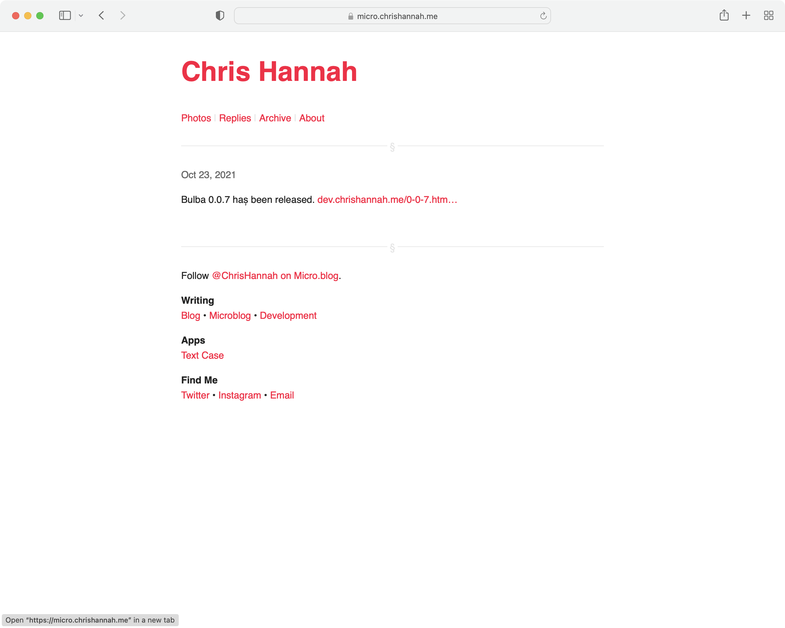
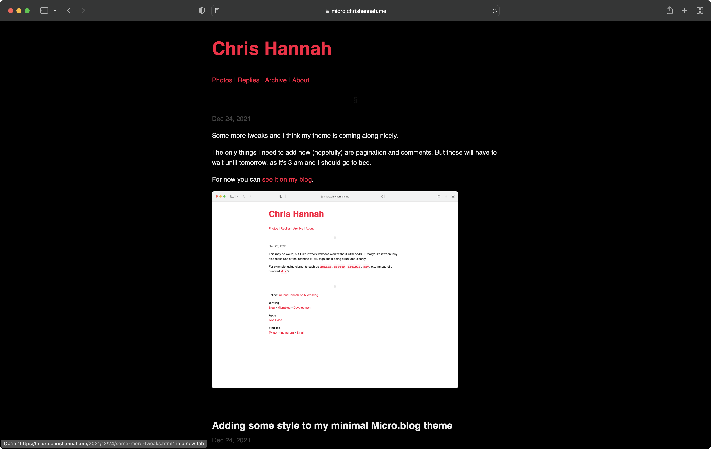

# Pure

A minimal theme for Micro.blog.

This theme was built around a few key ideas:

- HTML should be as semantic and clear as possible.
- The page should be readable without CSS or JavaScript.
- Style should be simplistic.

There is also the desire for this theme to be a good base for other themes. Because of the semantic HTML, it should be relatively easy to modify the CSS to make the theme more personalised.

## Screenshots

For a full preview you can check out my [microblog](https://micro.chrishannah.me).

## Code Style

The code style is handled by [Restyled](https://restyled.io), which will check the style on pull requests, and even point to a new pull request with suggested style changes.
